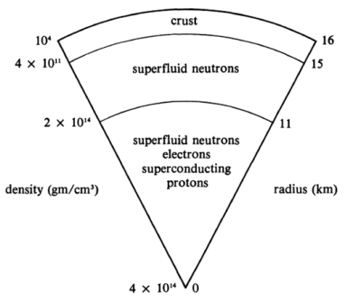

_A star, in its last stages, has various processes going on in its several composite layers. With typical high energy nuclear fusion of hydrogen to form helium, heavier elements being created in the subsequent inner layers from carbon and oxygen to the more stable Fe56 in the core._

Spinning neutron stars emit pulses of radiation. The absolute stability of these ‘pulses’ indicates that the magnetic field is rigidly anchored to the surface of the neutron star. Thus proving, the outer crust to consist of crystalline ferromagnetic Fe56 lattice to minimize the spin entropy.

As one goes deeper, even by a few meters, the density will dramatically increase due to the exponential increase in gravitational pressure. By the time density reaches 104 g cm-3, the atoms will be completely ionized. At a density of 107 g cm-3, the free electron gas would be relativistically degenerate. Around this density, when the Fermi energy exceeds 1 MeV, Fe56 will no longer be the most favorable nucleus due to Inverse Beta decay. Here, the most stable nucleus is Ni62. As we go deeper into the star, the nuclei become more and more neutron-rich. When we reach down even deeper, the most stable nuclei will include unearthly Kr118, Sr120, Zr122, and Mo124 with 82 neutrons and several other radioactive nuclei having about 50 neutrons. At a density of 4.3 x 1011 g cm-3, the nuclei become so neutron-rich that neutrons begin to “drip out” of the nuclei. Hence, we have a lattice of exotic nuclei embedded in a fermi sea of free and highly degenerate neutrons. This forms the inner crust of the neutron star.

Still going deeper, when we reach a density of 2.5 x 1014 g cm-3, the nuclei themselves start to melt, and inside that, there’d be just a ‘soup’ of neutrons, electrons, and protons. The relative number of neutrons, protons, and electrons can be obtained by demanding equilibrium under Beta decay.

This gives protons and electrons to be around 5% each. In such a realm, one has to solve the many-body schrödinger equation while including 3 body forces and deriving the nuclear potential from scattering experiments. Thus, using the Bardeen-Cooper-Schrieffer theory of superconductivity, A.B. Migdal argued that protons in the core will be superconductive, and V.L. Ginzburg proposed that neutrons in the center will be superfluid and electrons will be ‘normal.’ The nuclear force between the neutrons and protons is strongly attracted to the order of millions of electron volts. Therefore, they form cooper pairs. Also, Migdal and Ginzburg and various colleagues argued that the transition temperature to superfluidity and superconductivity will be very much greater than the actual interior temperature of the neutron star.

This neutron superfluidity has significant astrophysical consequences. Whenever the neutron star spins up, there is a strong star quake whose energy release would correspond to 50 on the Richter scale! The slow recovery of these starquakes taking tens of years can be attributed to the presence of superfluid in the core. Also, the Onsager-Feynman quantized vortices are responsible for the enormous magnetic flux of the neutron star. In addition to the electrons, superfluid neutrons, and superconductive protons, there also may be a portion of exotic particles such as pions, muons, or leptons in the core.