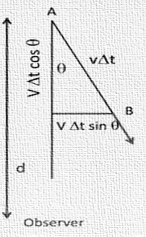
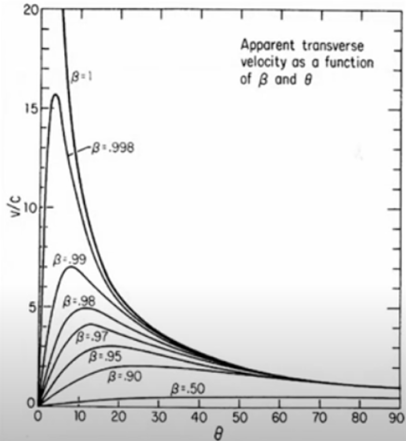

### In the late 1950s, the discovery of Quasar 3C 273 shocked scientists all around the world. There was something strange about its jets; they seemed to be moving at speeds higher than the speed of light!!

When Einstein set forth his relativity theory, this was his inviolable principle: that there was an ultimate cosmic limit, and only massless particles could ever achieve it. All massive particles could only approach it but never reach it. Nothing can move faster than light.

While studying the quasar 3C 273’s jets, Martin Rees found that the jets observed were only one-sided. He predicted that these one-sided jets could be due to its relativistic speed, hence giving rise to Doppler favoritism. He also predicted that these jets show superluminal motion. Superluminal motion can be considered an illusion that the cosmos plays on us; that is, we observe apparent motions greater than light’s speed.

Let us visualize how the Superluminal motion takes place. Imagine a source at some position A ejecting a blob source that moves at speed ‘v’ in a direction making angle θ to the observer. In a time Δt (w.r.t. to the blob), it moves a distance ‘vΔt’ and arrives at a point B. Let the light arrives from A and B at times t1 and t2.

When the blob reaches point B, it is closer to us, which gives rise to the doppler shift. Therefore, the apparent speed that we see in the sky is given by ‘vapp ‘ and t2 – t1 is the arrival time between two pulses.

The apparent velocity is related to the actual velocity of the source by βapp, and this βapp has a maximum value when cos θ = β. The maximum value of βapp isn’t β but γβ. This γ can be a huge number.

The graph represents Apparent Transverse Velocity as a function of β and θ . Notice that as β approaches 1, the Apparent velocity reaches several times the speed of light.

We can see that although the actual velocity of any particle cannot exceed the causality limit, the apparent velocity of the particle may know no bounds whatsoever! This phenomenon has been observed in quasars 3C 273, 3C 279, M87, etc.